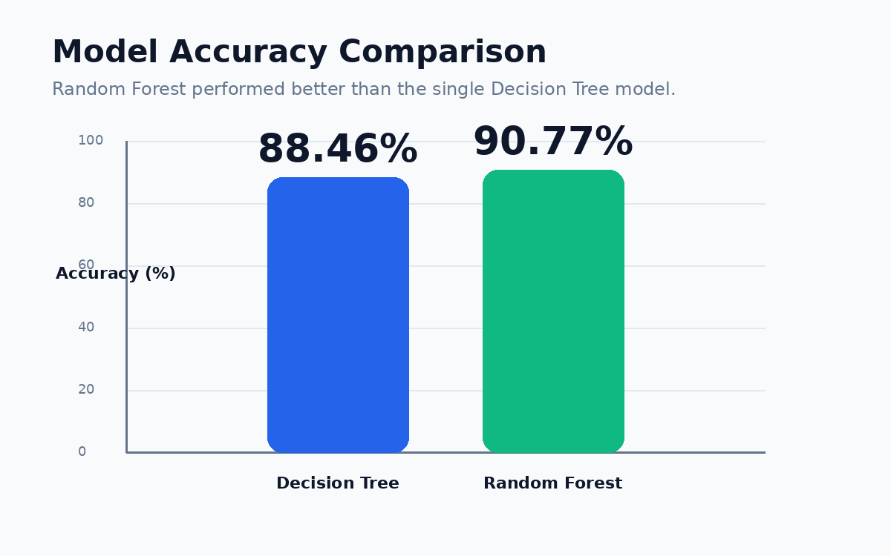
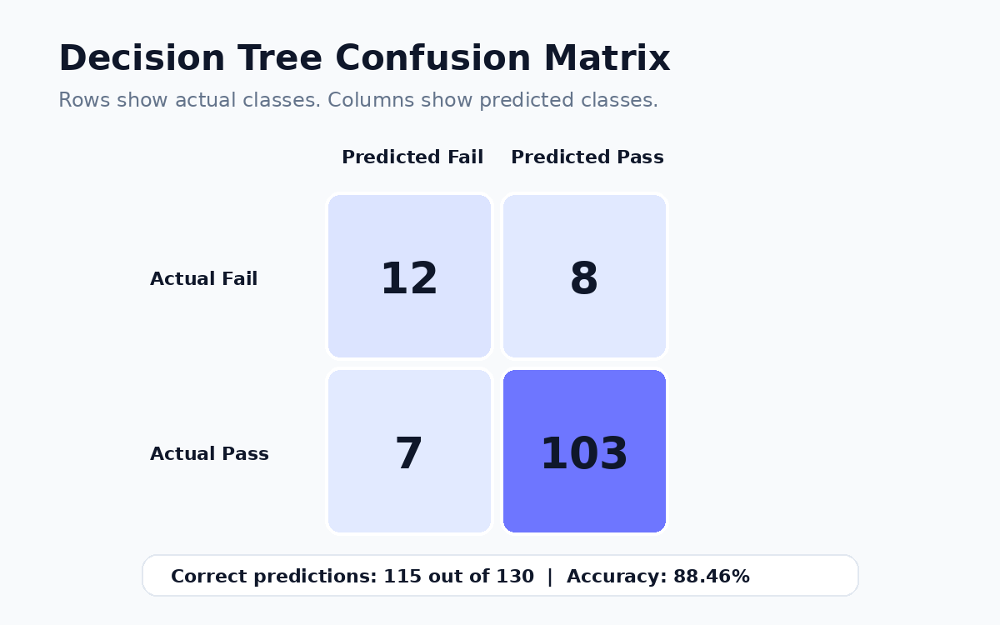
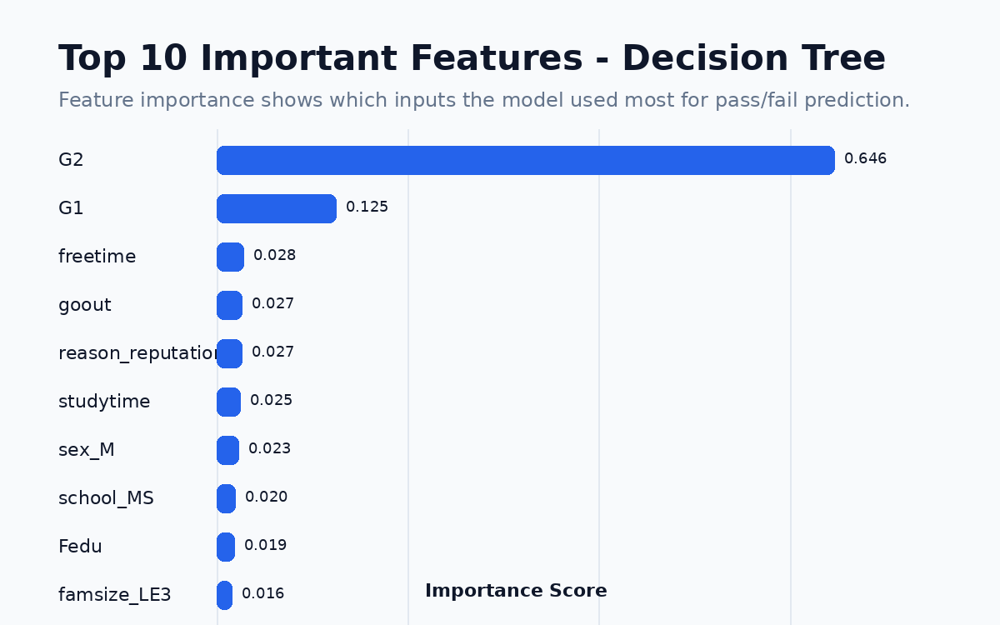

# Student Pass/Fail Performance Prediction Using Data Mining

This is my first Data Mining project. The goal of this project is to predict whether a student will pass or fail using the UCI Student Performance Dataset.

## Project Overview

In this project, I used student academic, demographic, and school-related data to build classification models. The target variable was created from the final grade `G3`.

- Pass = 1 if `G3 >= 10`
- Fail = 0 if `G3 < 10`

## Dataset

Dataset: UCI Student Performance Dataset

The dataset contains student information such as previous grades, study time, failures, family background, school information, and social factors.

## Methodology

The project followed these steps:

1. Loaded the UCI Student Performance Dataset
2. Explored the dataset
3. Checked missing values
4. Created a binary pass/fail target from `G3`
5. Removed target leakage columns when needed
6. Converted categorical variables using one-hot encoding
7. Split the data into training and testing sets
8. Trained a Decision Tree classifier
9. Trained a Random Forest classifier
10. Evaluated models using accuracy, confusion matrix, precision, recall, and F1-score
11. Visualized feature importance

## Models Used

### Decision Tree

A Decision Tree classifier was used as the first model. It makes predictions by splitting the dataset based on feature values.

### Random Forest

A Random Forest classifier was used as the second model. It combines multiple decision trees and usually gives better performance than a single tree.

## Results

| Model | Accuracy |
|---|---:|
| Decision Tree | 88.46% |
| Random Forest | 90.77% |

The Random Forest model performed better than the Decision Tree model.

## Visualizations

### Model Accuracy Comparison

### Confusion Matrix

### Feature Importance

## Key Findings

The most important features were:

- `G2`: second period grade
- `G1`: first period grade
- `freetime`
- `goout`
- `reason_reputation`

Previous grades, especially `G2` and `G1`, were the strongest predictors of final pass/fail performance.

## Tools and Libraries

- Python
- Google Colab
- pandas
- numpy
- matplotlib
- seaborn
- scikit-learn
